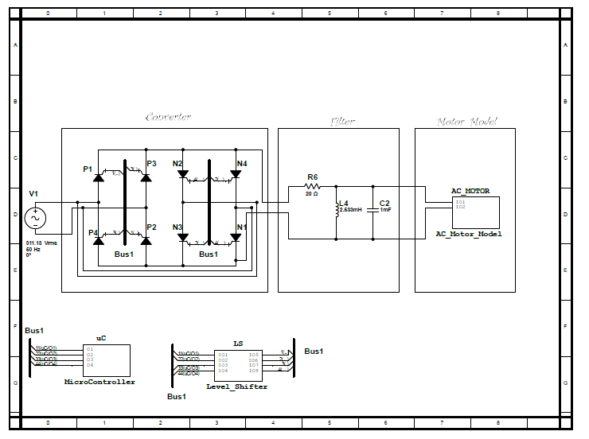

# **Single-Stage-Frequency-Converter**
## Brif Discription 
The idea is to design a single stage frequency converter so as to control speed of an induction motor. Multisim Simulation software is used for simulation. MPLAB IDE was used for writing the header and C programs for the PIC microcontroller. The microcontroller is used to trigger the GTOs (Gate Turn Off) sequentially. GTO is used in the design of this single phase to single phase cycloconverters as it does not really involve high power ratings and it can easily be turned on by a positive gate current and turned off by a negative gate current at its gate cathode terminals.

## Steps to access the simulation 
> - Open the file '*TestCYCLO_MainFile.ms12*' 
> - Double Click on the microcontroller box  
> - Click on '*Open Subsheet*' 
> - Double Click on the **PIC16F84A** 
> - Click on the *Code* Tab 
> - Click on *Properties* 
> - Click on *Project1* 
> - Click on *Browse* 
> - Go to the path '*New.X\dist\default\production*'   
> - Then select the *.hex* file  
> - Press *ok* then enjoy simulating!!  
## Block Diagram for Single Stage Frequency Converter 

